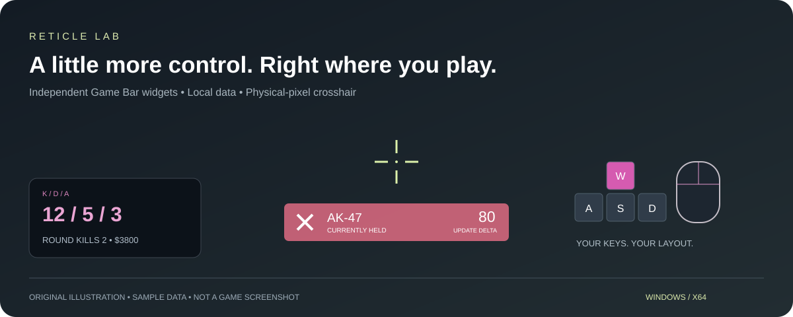
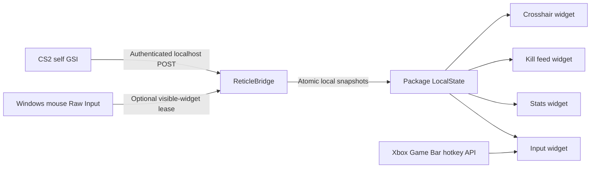

<div align="center">

# Reticle Lab

**Your crosshair. Your layout. Your data stays local.**

A Windows Xbox Game Bar overlay with pixel-aware crosshairs, independent kill feedback, live self statistics, and configurable keyboard/mouse visuals.

[简体中文](README.zh-CN.md) · [Install](#install) · [Build](#build-from-source) · [CS2 data](#cs2-data) · [Safety review](docs/ANTI-CHEAT-REVIEW.md)



**Windows x64 · Game Bar · C# / .NET 10 · MIT project code · Development release 0.2.11**

[0.2.11 changes](docs/RELEASE-0.2.11.md): kill-streak ordinals when damage is unavailable and pinned crosshair cursor handling. [OBS capture](docs/OBS-CAPTURE.md).

</div>

## Four widgets, one workspace

| Widget | What you can tune |
| --- | --- |
| **Crosshair** | Cross, ring, center dot, color, physical-pixel size, anti-aliasing, one-pixel nudges and live preview. |
| **Kill feedback** | Separate rows per kill, quartic easing, independent position, color and timing. Damage is labeled as the **GSI update delta**. |
| **Live stats** | K/D/A, round kills, headshot-kill ratio, available damage and money. Per-item labels, sizes, visibility and snapping. |
| **Keyboard & mouse** | Per-key A/B display modes, editable bindings, mouse-button highlighting and auto-fitting motion trails within a fixed panel. |

### Display and input

- Crosshair size and arrow-key movement default to **physical pixels**, including scaled Windows desktops.
- Cached visuals, reusable feedback objects and batched mouse trails reduce rendering overhead.
- A configurable **1–240 FPS target** coalesces updates. Idle animation timers stop; data sampling stays independent.
- Mouse detection uses documented, mouse-only **Windows Raw Input**, with a switch and a visible-widget lease.
- Settings and gameplay data stay on the current computer.

## Install

Extract `ReticleLab-0.2.10-windows-x64.zip` and follow these steps.

1. Extract the **whole** ZIP to a writable folder. Do not run the installer from inside the ZIP.
2. Run `Install-ReticleLab.cmd` under the Windows account that will use the widgets. The script validates package hashes, signatures, publisher and dependencies. Windows asks for administrator approval **only when the development certificate needs to be trusted**.
3. Ensure Xbox Game Bar is installed, then press **Win + G**, open the Reticle widgets and pin them. Updates request shutdown of this package's existing widgets/helper and preserve settings.
4. Optional CS2 integration: open Reticle settings → **GSI** → start/check receiver. Run `Setup-GSI.cmd` from the bundle, then restart CS2. It finds Steam libraries and installs the **new computer's own** generated configuration, backing up an existing Reticle config.

If Steam detection fails:

```powershell
.\Setup-GSI.cmd -Cs2Directory "<CS2 installation directory>"
```

Requirements: **Windows 10 build 19041+ or Windows 11 x64, and Xbox Game Bar**. The bundle includes the .NET runtime, x64 Visual C++ framework dependency and development certificate.

The MSIX installer uses a self-signed development certificate. See [installation details and troubleshooting](docs/INSTALL.md).

## CS2 data

The receiver accepts authenticated GSI only on `127.0.0.1:29841`. It requires the local player identity to match the provider and quarantines spectated-player state.

| Requested feedback | Implemented meaning |
| --- | --- |
| Kill | Change in reliable self kill counters; initial connection and reconnection do not replay history. |
| Two kills in one update | Two separate rows. Crosshair effects queue for separate playback; this queue is presentation timing. |
| Headshot kill | Confirmed only when the available counters permit attribution. Mixed aggregate attribution stays unknown. |
| Weapon | **Currently held** weapon fallback; not a claim about which weapon caused the kill. |
| Damage number | Difference between consecutive valid `round_totaldmg` samples, labeled **更新增量**. Split rows from one update carry the same update total; do not sum those rows. |
| Missing damage / reset / reconnect | Kill feedback shows life-streak ordinals when a reliable damage delta is unavailable. A valid unchanged counter gives **0**. |
| Body/head hit, hit accuracy, per-victim damage | Not reliably available from the self GSI used here. Hit buttons are explicitly **demos**. |
| Buy menu | Not detected. Optional dimming follows the entire freeze phase. |

## Architecture



The bridge runs as a declared full-trust desktop helper and shares local snapshots with the four widgets.

## Build from source

Requirements: Windows x64, .NET SDK 10, PowerShell 7 for development signing, Windows PowerShell 5.1 for the installer tests, Python 3 and Node.js for auxiliary checks. NuGet restore requires network access. Noto fonts and app icons are included.

```powershell
.\native\scripts\build.ps1
# The output prints the new artifact directory.
python native/scripts/audit.py --package "<unsigned.msix>"
python native/scripts/http_smoke.py "<artifact directory>/package/Bridge/ReticleBridge.dll"
node --test tests/model.test.cjs tests/overlays.test.cjs
python tests/check_assets.py
```

`build.ps1` runs core smoke tests, publishes both processes, audits the compiled entry point/native API boundary and validates the MSIX. Build tools and SDK metadata are restored from pinned NuGet dependencies.

For local signing and distribution, follow [the signing guide](native/DEVELOPMENT-SIGNING.md). Forks should configure their own signing identity and installer certificate pins.

## Validation and limits

The source includes **148 core checks**, authenticated HTTP receiver tests, real mouse registration/lease and sharing-recovery checks, package integrity checks, installer negative tests and public-export scanning. See [validation](native/VALIDATION.md) for the actual executed scope.

Game Bar appearance, in-game input, multi-monitor centering, long-session stability and actual frame rate require interactive validation.

The app uses local self GSI, Game Bar APIs and optional mouse Raw Input, without game hooks, injection or game-memory access. This does not constitute VAC approval; see the [anti-cheat review](docs/ANTI-CHEAT-REVIEW.md).

## Contribute

Bug reports with reproducible steps and sanitized diagnostics are welcome. See [CONTRIBUTING.md](CONTRIBUTING.md) and [SECURITY.md](SECURITY.md). Keep unknown values unknown; do not add memory reads, injection, input automation or inferred enemy information.

## License and credits

Project-authored code and original illustrations: **[MIT](LICENSE)**. Noto fonts: **SIL OFL 1.1**. Microsoft SDK/runtime components keep their own licenses; they are not relicensed under MIT. See [third-party notices](native/THIRD-PARTY.md).
